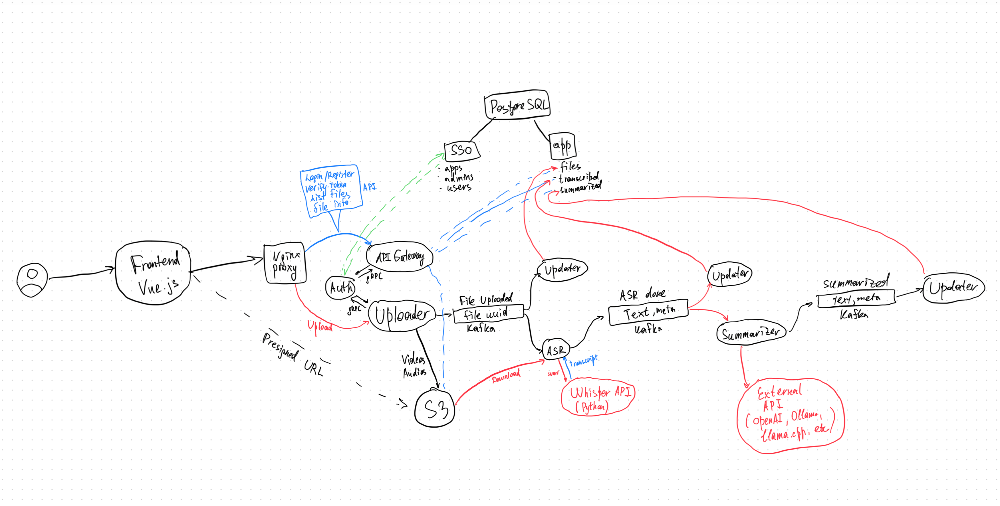

# Lectura

Lectura is a modular, container-based platform designed primarily for students to **upload**, **transcribe**, and **summarize lectures** automatically. It integrates various services written in **Go** and **Python**, and is orchestrated via **Docker Compose**. Authentication, messaging, and storage are handled internally or externally depending on deployment preference.

---

## Features

- **Authentication** service (SSO-style) with JWT
- **Uploader** for uploading lecture recordings
- **ASR (Automatic Speech Recognition)** using Whisper API
- **Summarizer** using OpenAI GPT-based model
- **API Gateway** that routes requests and validates tokens
- **Frontend** for user interaction
- Pluggable backend services: PostgreSQL, Kafka, MinIO (can be external)
- Written in **Go** and **Python**
- Docker Compose orchestration

---

## Video showcase

// insert here

---

## Architecture Diagram




---

## Technologies Used

| Component   | Stack                 |
| ----------- | --------------------- |
| API Gateway | Go                    |
| Uploader    | Go                    |
| ASR         | Python + Whisper      |
| Summarizer  | Python + OpenAI API   |
| Auth        | Go + JWT              |
| Kafka       | Apache Kafka          |
| Storage     | MinIO (S3-compatible) |
| Database    | PostgreSQL            |
| Frontend    | Vue.js + Nginx        |

---

## Services Overview

| Service         | Description                                    |
| --------------- | ---------------------------------------------- |
| **auth**        | Authentication and token generation            |
| **uploader**    | Receives file uploads and publishes to Kafka   |
| **asr**         | Converts speech to text using Whisper          |
| **summarizer**  | Generates summaries from transcriptions        |
| **whisper-api** | Lightweight HTTP wrapper around Whisper model  |
| **api-gateway** | Central routing and validation entrypoint      |
| **updater**     | Handles updates to lecture metadata            |
| **frontend**    | Static frontend served via Nginx               |
| **migrator**    | Initializes and migrates the PostgreSQL schema |

---

## Deployment

### Prerequisites

Make sure the following external services are available **if not using containers**:

- Kafka
- PostgreSQL
- MinIO

Adjust `.env` or config files accordingly to point services to the right external endpoints.

### Run with Docker Compose

```bash
docker-compose up --build
```

> Note: Some services like Kafka, MinIO, and PostgreSQL are **commented out** in the `docker-compose.yml` file. Uncomment them if you want a fully local setup.

---

## Authentication

Lectura uses **JWT-based authentication, based on one of my other microservices**. View **[sso-auth](https://github.com/kxddry/sso-auth)** for more information. Keys (ed25519) must be present in the `.keys/` directory:

```
.keys/
├── auth-private.pem
├── auth-public.pem
├── uploader-private.pem
├── uploader-public.pem
├── api-gateway-private.pem
├── api-gateway-public.pem
```

Each service verifies requests using the appropriate public key.

---

## Configuration Files

All services use mounted config files under `.config/`. Examples:

```
.config/
├── upload.yaml
├── asr.yaml
├── sum.yaml
├── api.yaml
├── auth.yaml
├── migrations.yaml
├── upd.yaml
```

You can modify service behavior, connection strings, Kafka topics, etc., in these YAML configs.

---

## Kafka Topics

Topics are managed by the `init-kafka` service (optional, used in local setup):

| Topic Name    | Description            |
| ------------- | ---------------------- |
| file.uploaded | Published after upload |
| asr.done      | ASR result ready       |
| sum.done      | Summarization complete |

---

## Flow Overview

1. User uploads a lecture file via frontend
2. `uploader` creates presigned URL and sends to frontend
3. Browser uploads the file to MinIO (S3)
4. `uploader` publishes file metadata to Kafka (`file.uploaded`)
5. `asr` consumes Kafka event, downloads file, transcribes using `whisper-api`
6. Transcript is published to Kafka (`asr.done`)
7. `summarizer` listens, generates summary via OpenAI or other models, and publishes (`sum.done`)
8. `updater` stores final summary + transcript in PostgreSQL

---

## Demo Video


> Click the image above to watch a demonstration of Lectura in action.

---

## To-Do

- 

---

## License

GNU GPL license. See [LICENSE](./LICENSE).

---

## Contributing

Pull requests are welcome! Please open an issue first to discuss major changes.

---

## Contact

Made with️ love by [@kxddry](https://github.com/kxddry)

