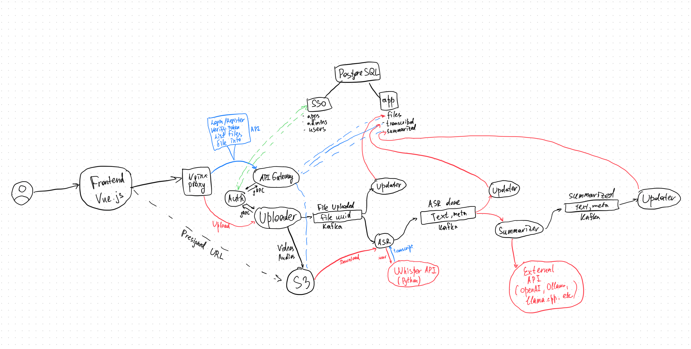

# Lectura

Lectura is a modular, container-based platform designed primarily for students to **upload**, **transcribe**, and **summarize lectures** automatically. It integrates various services written in **Go** and **Python**, and is orchestrated via **Docker Compose**. Authentication, messaging, and storage are handled internally or externally depending on deployment preference.

---

## Features

- **Authentication** service (SSO-style) with JWT
- **Uploader** for uploading lecture recordings
- **ASR (Automatic Speech Recognition)** using Whisper API
- **Summarizer** using OpenAI GPT-based model
- **API Gateway** that routes requests and validates tokens
- **Frontend** for user interaction
- Pluggable backend services: PostgreSQL, Kafka, MinIO (can be external)
- Written in **Go** and **Python**
- Docker Compose orchestration

---

## Video showcase

https://github.com/user-attachments/assets/5ab2c419-44b1-4294-b245-15b0466462b5

---

## Architecture Diagram

---

## Flow Overview

1. User uploads a video file via frontend
2. `uploader` creates presigned URL and sends to frontend
3. Browser uploads the file to MinIO (S3)
4. `uploader` publishes file metadata to Kafka (`file.uploaded`)
5. `asr` consumes Kafka event, downloads file, transcribes using `whisper-api`
6. Transcript is published to Kafka (`asr.done`)
7. `summarizer` listens, generates summary via OpenAI or other models, and publishes (`sum.done`)
8. `updater` stores final summary + transcript in PostgreSQL

---

Note: the source code is closed. This repository was made to showcase the product.

Made with️ love by [@kxddry](https://github.com/kxddry)

